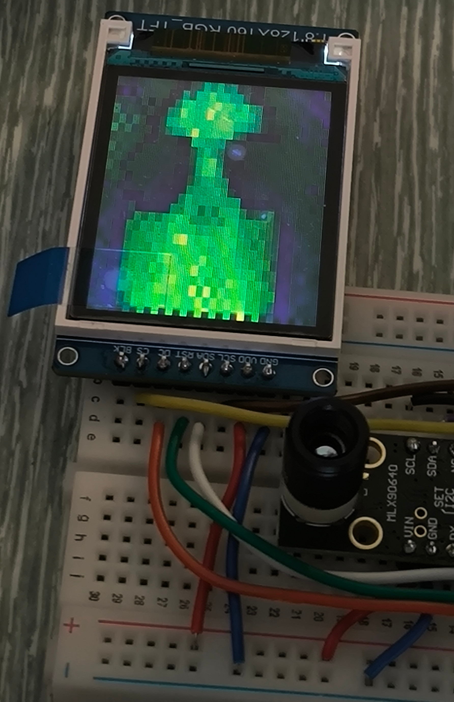
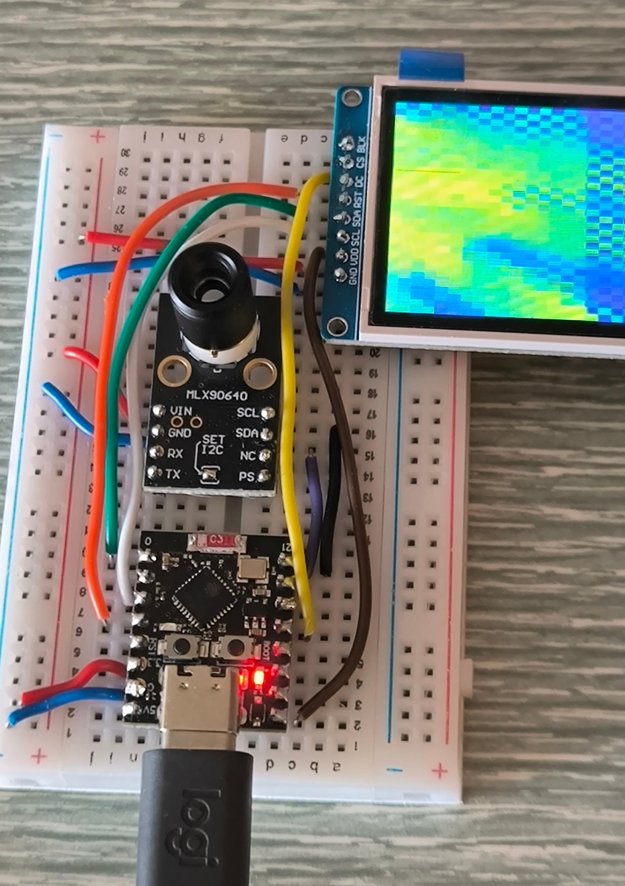

# Thermal imagery MLX90640 and ST7735 with micropython


## Concepts
The concept of this project is to display the MLX90640 imagery on a ST7735 LCD screen on esp32-c3 board with micropython.


<table align="center">
  <tr>
    <td align="center">
      <br/>
      <b>Display of the MLX90640 image via a ST7735 LCD display.</b>
    </td>
    <td align="center">
      <br/>
      <b>Thermal image display via native micropython strategy.</b>
    </td>
  </tr>
</table>


## Components
### Preparation of MLX90640 for i2c communication
To enable the i2c communication of the MLX90640, the i2c pins should be soldered as mentioned here [https://github.com/adafruit/Adafruit_CircuitPython_MLX90640/issues/19].


### Wiring
Connect the devices as follow:

- pin_cam_sda = 20
- pin_cam_scl = 21
- pin_scl = 5
- pin_sda = 2
- pin_res = 0
- pin_dc  = 3
- pin_cs  = 9


### Breadboard
<table align="center">
  <tr>
    <td align="center">
      <br/>
      <b>Breadboard integration for debug purpose.</b>
    </td>
  </tr>
</table>


## Software versionning 
Different version of this software is proposed:

- *Native_micropython* is based on a micropython firmware with uploaded librairies. It's obviously slow since my code send each pixel individually (via x,y positions). In theory, I should be able to send stream of data, but not able to find it via micropython. 

- *Precompiled_micropython* is based on a micropython firmware with embedded ST7735 [https://github.com/russhughes/st7789_mpy]. It's based on the driver written in C, which should be more efficient (i.e.: should send stream of data instead).


### Native micropython installation

The main script *main.py* should load these two librairies and upload the image received from the thermal camera on the LCD display.


#### Micropython firmware
First, upload the generic esp32-c3 firmware via:

```
esptool --port /dev/ttyACM0 erase_flash
esptool --port /dev/ttyACM0 --baud 460800 write_flash 0 ESP32_GENERIC_C3-20250415-v1.25.0.bin
```


#### Upload typing
Execute the following script from you linux terminal:

```
sudo apt install micropython-mpremote
mpremote mip install github:josverl/micropython-stubs/mip/typing.mpy
```

you should see:

```
Install github:josverl/micropython-stubs/mip/typing.mpy
Downloading github:josverl/micropython-stubs/mip/typing.mpy to /lib
Installing: /lib/typing.mpy
Done
```


#### Source of the code
The display ST7735 and the sensor MLX90640 are based on the librairies deployed here:

- ST7735 [https://github.com/boochow/MicroPython-ST7735]
- MLX90640 [https://github.com/michael-sulyak/micropython-mlx90640]


### Drawback of different strategies
The main actual drawback of the *native_micropython* is the slow fps display (around 13s per frame).
For fast fps, please refer to the *all .cpp* script here [https://github.com/weinand/thermal-imaging-camera].

The issue with *Native_micropython* has been discussed here:

- [https://www.reddit.com/r/raspberrypipico/comments/16q4jkj/help_finding_a_fast_library_for_18inch_st7735s/]
- [https://www.reddit.com/r/raspberrypipico/comments/zx32ak/very_slow_refresh_rate_for_st7735/]


## Debug purpose
If the thermal camera returns no image, please follow the Waveshare tutorial here [https://www.waveshare.com/wiki/MLX90640-D55_Thermal_Camera]


